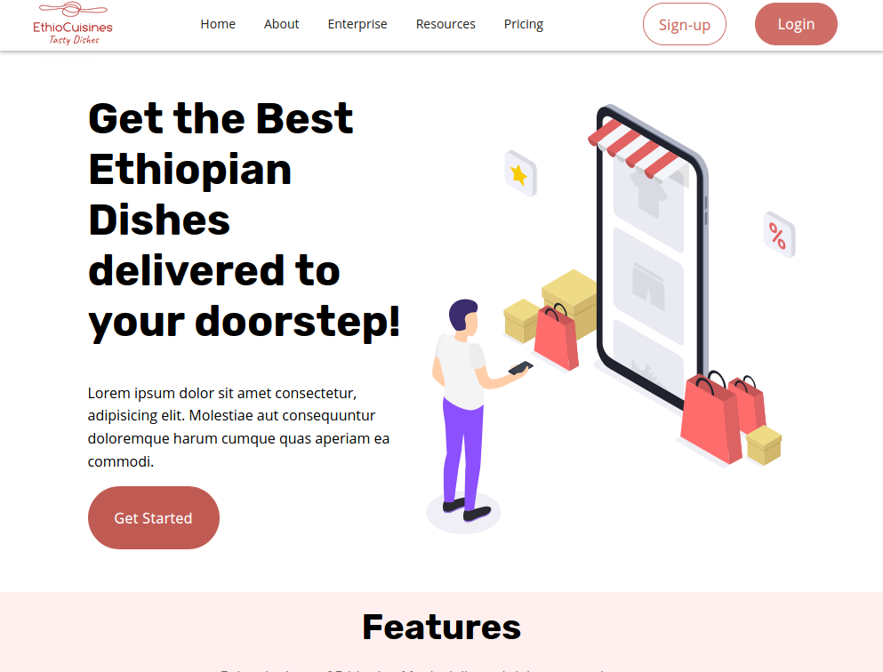

<!-- ABOUT THE PROJECT -->
## Responsive Landing Page

[](https://borehelu.github.io/Product-Landing/)

#### A complete product landing page implemented using HTML5 and CSS3, 22 Apr 2021
#### By **Helu Bore**

## Description

This webpage is a product landing page for fictitious Online Food Delivery Service. It contains all the sections of a single page product landing page. The purpose of the application is to explore css media queries in designing responsive websites. No frameworks or other libraries were used during the project.

### Built With

This project was built using
* [HTML5](https://developer.mozilla.org/en-US/docs/Web/Guide/HTML/HTML5)
* [CSS3](https://developer.mozilla.org/en-US/docs/Web/CSS)


<!-- GETTING STARTED -->
## Getting Started


### Installation


1. Clone the repo
   ```sh
   git clone https://github.com/borehelu/Responsive-Landing-Page.git
   ```
2. Open with preferred code editor.
3. Run `index.html` in browser.


<!-- USAGE EXAMPLES -->
## Usage

Use this space to show useful examples of how a project can be used. Additional screenshots, code examples and demos work well in this space. You may also link to more resources.

_For more examples, please refer to the [Media Queries](https://developer.mozilla.org/en-US/docs/Web/CSS/Media_Queries/Using_media_queries)_


<!-- LICENSE -->
## License

Distributed under the MIT License. See `LICENSE` for more information.


<!-- CONTACT -->
## Contact

Helu Bore - [@helubore
](https://twitter.com/helu_bore) - borehelu@gmail.com

Project Link: [https://github.com/borehelu/Responsive-Landing-Page](https://github.com/borehelu/Responsive-Landing-Page)


<!-- ACKNOWLEDGEMENTS -->
## Acknowledgements

* [css-tricks](https://css-tricks.com/)

* [Font Awesome](https://fontawesome.com)
